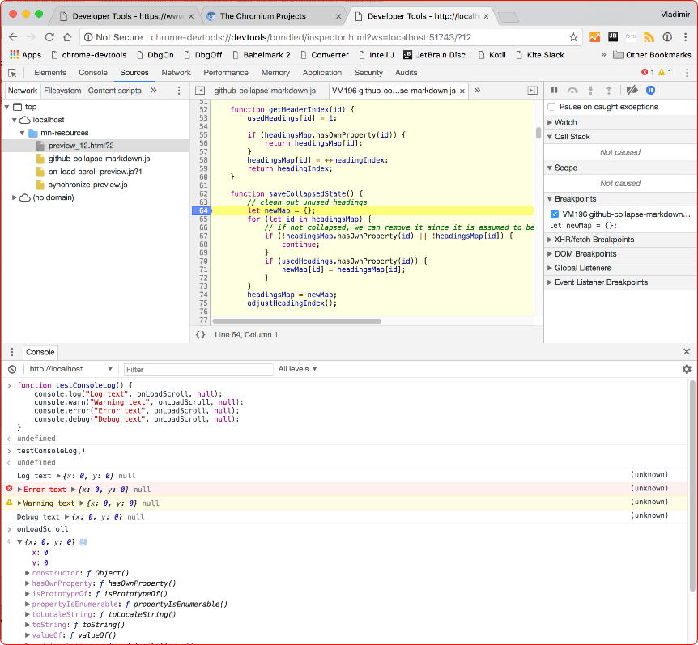

# JavaFX WebView Debugger 

##### Via WebSocket connection to Google Chrome Dev Tools

Based on [mohamnag/javafx_webview_debugger] but rewritten to use [TooTallNate/Java-WebSocket]
instead of org.eclipse.jetty. Much lighter on size and painless to get working, at least in a
JetBrains plugin.

In turn that library was based on the solution found by Bosko Popovic and well documented by
Mohammad Naghavi. Working with JS code in WebView became tolerable. Not IDE comfortable, but a
whole lot more productive than trying to figure bugs through log messages.

The limitations for chrome dev tools in JavaFX WebView with a bare-bones implementation were
significant. The console evaluations did not work and none of the console api calls from scripts
made it to the debugger console.

Custom code to handle the dev tools protocol made Dev Tools work with WebView and vice versa.
There are still some limitations but these have to do with the fact that the debugger cannot
provide Dev Tools with much information until the custom `JSBridge` is established to allow
JavaScript to reach the Java world.

Now the console in the debugger works as expected, with completions, evaluations and console
logging from scripts, stepping in/out/into, break points and especially initialization debugging
to handle the difficulty of figuring out what went wrong before the JSBridge to JavaScript is
established. Makes minced meat of initialization debugging.

The current version of the library is the bare-bones implementation and just usable. I will be
updating it with the full feature version.

It will take a bit of work since the code I use is in an [IntelliJ IDEA] plugin,
[Markdown Navigator]. The source is a mix of Java and [Kotlin] with a good measure of JetBrains
API specifics and will take some effort to remove all these for use on any JavaFx WebView
project and to re-test to make sure it works. The inner working of the debugger are very fragile
and easy to make it core-dump right out of the application.

If you are working with JavaFX WebView scripts and need this functionality ASAP, please contact
me and I will see if we can make this happen sooner than later. A little motivation can go a
long way.

Here is a teaser screenshot of dev tools running with JavaFX WebView, showing off the console
logging from scripts, with caller location for one click navigation to source:



### JSBridge Provided Debugging Support  

The missing functionality from the WebView debugger is implemented via a proxy that gets between
chrome dev tools and the debugger to fill in the blanks and to massage the conversation allowing
chrome dev tools to do their magic.

For this to work, some JavaScript and the `JSBridge` instance need to work together to provide
the essential glue. The implementation is done so that outside of this code the rest of the
JavaScript can be oblivious to whether the `JSBridge` is already established or not. Since
console log api is one of the missing pieces in the WebView debugger, any console log calls
before the `JSBridge` is established **will not have caller identification** and will instead
point to the initialization code that played back the cached log calls generated before the
connection was established.

The `JSBridge` implementation also provides a mechanism for data persistence between page
reloads. It is generic enough if all the data you need to persist can be `JSON.stringify'd`
because the implementation does a call back to the WebView engine to serialize the passed in
state argument. This text will need to be inserted into the generated HTML page to allow scripts
access to their state before the `JSBridge` is established. Alternately, scripts can register
for a callback when the `JSBridge` is established.

The down side of the latter approach, is by the time this happens, WebView has already visually
updated the page. If the script is responsible for any visual modification of the page before
display then the unmodified version will flash on before the script is run.

Allowing scripts to get their state before `JSBridge` is established will make for smoother page
refresh.

**The rest of this file is mostly a copy of one in [mohamnag/javafx_webview_debugger] project**
with some changes to reflect being able to run multiple debugging sessions on a single server.

Using debugger is done in three main steps:

1. Starting debug server
2. Connecting chrome debugger
3. Clean up

### Starting debug server

If you are using Java up to version 8, to enable debugging on a chosen WebView, you have to add
following code using its `webEngine`:

```java
DevToolsDebuggerServer devToolsDebuggerServer(webEngine.impl_getDebugger(), 51742, 1);
```

`WebEngine.impl_getDebugger()` is an internal API and is subject to change which is happened in
Java 9. So if you are using Java 9, you need to use following code instead to start the debug
server:

```java
Class webEngineClazz = WebEngine.class;

Field debuggerField = webEngineClazz.getDeclaredField("debugger");
debuggerField.setAccessible(true);

Debugger debugger = (Debugger) debuggerField.get(webView.getEngine());
DevToolsDebuggerServer devToolsDebuggerServer.startDebugServer(debugger, 51742, 1);
```

For this to work, you have to pass this parameter to Java compiler: `--add-exports
javafx.web/com.sun.javafx.scene.web=ALL-UNNAMED`.

As examples, this can be done for Maven as follows:

```xml
<plugin>
    <groupId>org.apache.maven.plugins</groupId>
    <artifactId>maven-compiler-plugin</artifactId>
    <version>3.7.0</version>
    <configuration>
        <source>9</source>
        <target>9</target>
        <compilerArgs>
            <arg>--add-exports</arg>
            <arg>javafx.web/com.sun.javafx.scene.web=ALL-UNNAMED</arg>
        </compilerArgs>
    </configuration>
 </plugin>
```

or for IntelliJ under **Additional command line parameters** in **Preferences > Build,
Execution, Deployment > Compiler > Java Compiler**.

### Connecting chrome debugger

Then you only need to open following URL in a chrome browser:

```
chrome-devtools://devtools/bundled/inspector.html?ws=localhost:51742/?1
```

Where 1, 2, 3, ... is the session number you passed to the `DevToolsDebuggerServer` constructor
and 51742 is the port passed to the debug server.

**NOTE**: since the web-socket server is a shared static instance, all sessions will have to use
the same port number.

### Clean up

For a proper shutdown you have to call following when exiting a session or turning off debugging
for it:

```java
devToolsDebuggerServer.stopDebugServer();
```

This will disconnect the JavaFX WebView debugger from its session and this instance of
`DevToolsDebuggerServer` will no longer be usable for debugging. To re-start debugging on the
same session number, create a new instance.

To shut down the web-socket server after all sessions have been stopped call:

```java
DevToolsDebuggerServer.shutdownWebSocketServer();
```

## No Library Installation

Code is too small and will most likely need to be customized for your project. Add the two small
files to your project and modify to your needs. Add [TooTallNate/Java-WebSocket] as a
dependency.

These files were pulled from a project after I got it all working nicely. Removed IntelliJ API
related code and put them here so they can be of use to others.

<!-- 
### Maven

To use maven add this dependency to your pom.xml:

```
<dependency>
  <groupId>org.java-websocket</groupId>
  <artifactId>Java-WebSocket</artifactId>
  <version>1.3.7</version>
</dependency>
```

### Gradle

To use Gradle add the maven central repository to your repositories list :

```
mavenCentral()
```

Then you can just add the latest version to your build.

```
compile "org.java-websocket:Java-WebSocket:1.3.7"
```
 -->

JetBrains IntelliJ project files included if you need to reference them, Library is configured
and downloaded into `lib/`

## Enabling the console

JavaFX WebView does not have a console defined, so console calls inside JavaScript are not
possible by default. In order to enable JavaScript logging inside JavaFX, a bridge class and a
separate listener for JavaScript are required.

#### Bridge class

```java
public class JavaBridge {

    public void log(String text) {
        System.out.println(text);
    }

    public void error(String text) {
        System.err.println(text);
    }
}
```

It is recommended to use `System.out.println` for writing to console and avoid any custom
loggers, as they can cause the entire method to be undefined.

#### Code inside Main class

```java
webEngine.setJavaScriptEnabled(true);

webEngine.getLoadWorker().stateProperty().addListener( new ChangeListener<State>() {
    @Override
    public void changed(ObservableValue ov, State oldState, State newState) {
        if (newState == Worker.State.SUCCEEDED) {
            JSObject window = (JSObject) webEngine.executeScript("window");
            JavaBridge javaBridge = new JavaBridge();
            window.setMember("console", javaBridge); // "console" object is now known to JavaScript
        }
    }
});

```

Note that the name *console* in `window.setMember` can be arbitrary, but it is recommended to
override the console instead because many JavaScript APIs make hidden calls to the console.
Since the console is undefined by default, JavaScript will most likely stop working after that
point.

#### JavaScript example

```javascript
function initializeMap() {

    var moscowLonLat = \[37.618423, 55.751244\];

    map = new ol.Map({
        target: 'map',
        view: new ol.View({
            center: ol.proj.fromLonLat(moscowLonLat),
            zoom: 14
        })
    });
    mapLayer = new ol.layer.Tile({
        source: new ol.source.OSM()
    });

    map.addLayer(mapLayer);

    console.log("Map initialized!"); // This will appear in the JavaFX console
}
```

[IntelliJ IDEA]: http://www.jetbrains.com/idea
[Kotlin]: http://kotlinlang.org
[Markdown Navigator]: http://vladsch.com/product/markdown-navigator 
[mohamnag/javafx_webview_debugger]: https://github.com/mohamnag/javafx_webview_debugger
[TooTallNate/Java-WebSocket]: https://github.com/TooTallNate/Java-WebSocket

